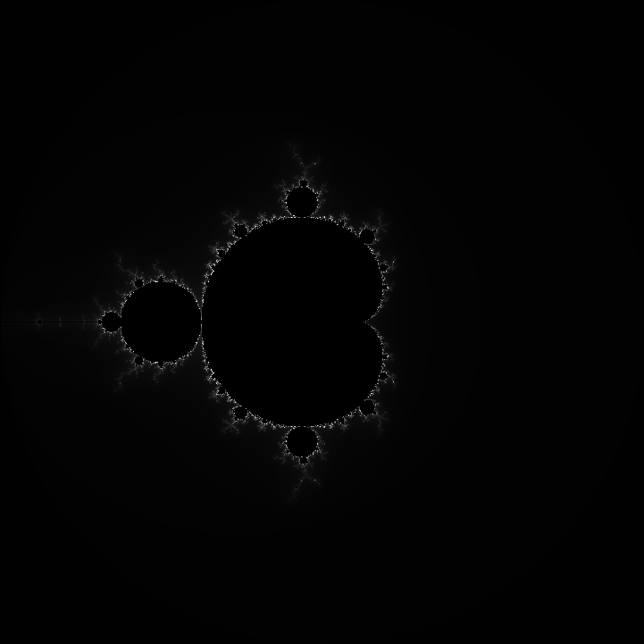

<h1>Mandelbrot</h1>
This repository includes an image of the Mandelbrot set (256 iterations in total). Feel free to use it.
<h2>Image Creation</h2>
Creating the iteration data took around 10 hours. 
You can recreate it from the image since I didn't color it.
<h2>Viewer Thing (mandelbrot_viewer.py)</h2>
I have written that thing because I couldn't zoom in on it otherwise. 
Note that it might be glitchy and inefficient; only use it if you can't find another method.
